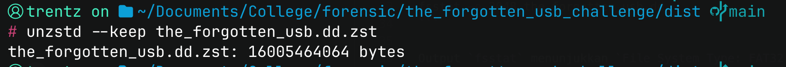
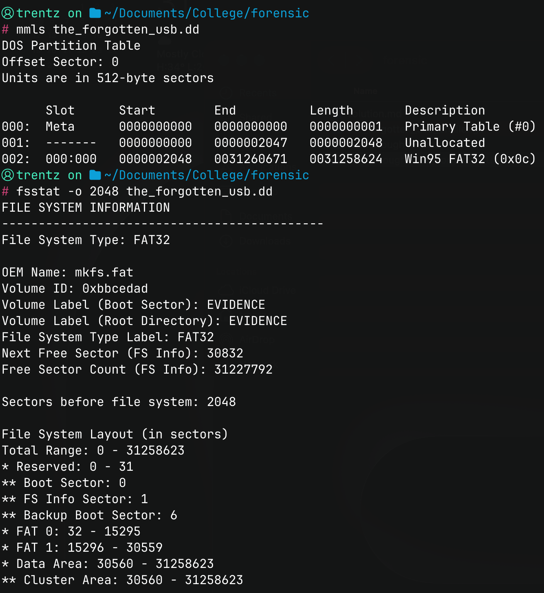
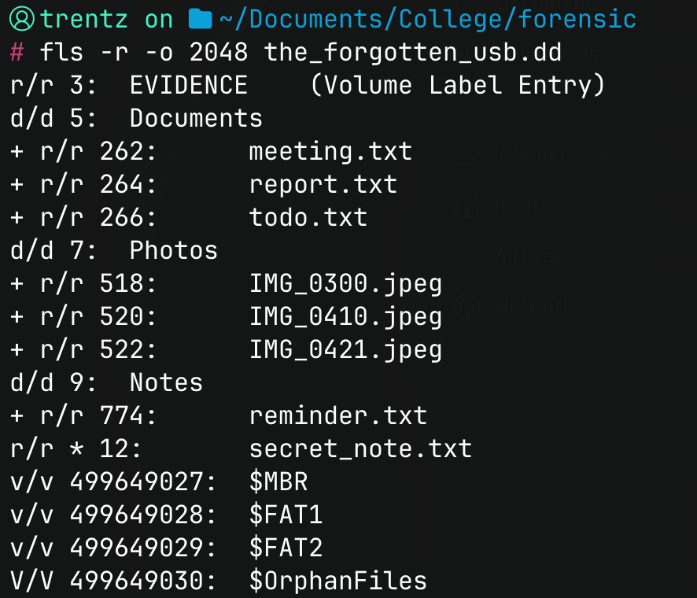
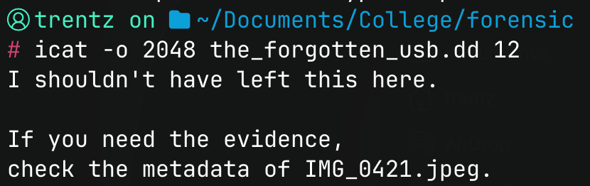
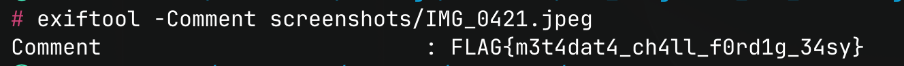

# The Forgotten USB — Solution

Soal ini menggunakan disk image USB dengan filesystem FAT32. Flag disimpan pada metadata sebuah foto, sedangkan petunjuk untuk menemukan foto tersebut berada di file yang sudah dihapus. Penyelesaian dilakukan dengan membaca file yang dihapus, mengikuti petunjuk di dalamnya, lalu memeriksa metadata foto yang disebutkan.

Tools yang digunakan adalah Zstandard, Sleuth Kit (`mmls`, `fsstat`, `fls`, dan `icat`), serta ExifTool. Perintah di bawah dijalankan dari folder `dist`.

## 1. Ekstrak disk image

Berkas `the_forgotten_usb.dd.zst` masih dikompresi menggunakan Zstandard. Ekstrak terlebih dahulu untuk mendapatkan raw disk image yang dapat dibaca oleh Sleuth Kit.

```bash
cd dist
unzstd --keep the_forgotten_usb.dd.zst
```

Hasil ekstraksi adalah `the_forgotten_usb.dd` dengan ukuran sekitar 15 GiB. Opsi `--keep` mempertahankan berkas kompresi asli setelah proses dekompresi selesai.



## 2. Periksa partisi dan filesystem

Gunakan `mmls` untuk melihat tabel partisi dan menentukan sektor awal filesystem.

```bash
mmls the_forgotten_usb.dd
```

Partisi pada image ini dimulai di sektor `2048` dan dikenali sebagai `Win95 FAT32 (0x0c)`. Pemeriksaan filesystem dapat dilanjutkan menggunakan offset tersebut.

```bash
fsstat -o 2048 the_forgotten_usb.dd
```

Output `fsstat` menunjukkan `File System Type: FAT32` dengan label volume `EVIDENCE`. Parameter `-o` pada Sleuth Kit menggunakan satuan sektor. Karena ukuran sektornya 512 byte, offset 2048 setara dengan 1.048.576 byte dari awal image, tetapi nilai yang digunakan pada perintah tetap `2048`.



## 3. Temukan file yang dihapus

Tampilkan daftar file secara rekursif agar isi subfolder ikut diperiksa.

```bash
fls -r -o 2048 the_forgotten_usb.dd
```

Selain folder `Documents`, `Photos`, dan `Notes`, terdapat entri berikut:

```text
r/r * 12: secret_note.txt
```

Tanda `*` menunjukkan bahwa `secret_note.txt` sudah dihapus. Angka `12` adalah alamat metadata file yang digunakan untuk membaca isinya melalui `icat`. Alamat ini berbeda dari offset partisi yang sebelumnya ditentukan menggunakan `mmls`.



## 4. Baca isi secret_note.txt

Meskipun sudah ditandai terhapus, isi catatan masih tersedia pada image ini. Gunakan alamat metadata `12` untuk membacanya.

```bash
icat -o 2048 the_forgotten_usb.dd 12
```

Isi file:

```text
I shouldn't have left this here.

If you need the evidence,
check the metadata of IMG_0421.jpeg.
```

Catatan tersebut memberikan nama file target sekaligus bagian yang perlu diperiksa, yaitu metadata `IMG_0421.jpeg`.



## 5. Ekstrak IMG_0421.jpeg

Pada output `fls`, foto yang disebutkan dalam catatan berada di folder `Photos` dengan alamat metadata `522`.

```text
+ r/r 522: IMG_0421.jpeg
```

Ekstrak file tersebut menggunakan `icat` dan simpan output-nya sebagai berkas JPEG.

```bash
icat -o 2048 the_forgotten_usb.dd 522 > IMG_0421.jpeg
```

Pengalihan output dengan `>` diperlukan karena isi file berupa data gambar. Hasil ekstraksi dapat dibuka sebagai foto biasa.

Foto tersebut menampilkan seekor kucing dengan ukuran 678 × 452 piksel. Tidak ada flag yang terlihat pada gambarnya. Pemeriksaan berikutnya dilakukan pada metadata, sesuai petunjuk dalam catatan.


## 6. Periksa metadata foto

Metadata gambar dapat dibaca menggunakan ExifTool.

```bash
exiftool IMG_0421.jpeg
```

Flag berada pada field `Comment`. Untuk menampilkan field tersebut saja, gunakan:

```bash
exiftool -Comment IMG_0421.jpeg
```

Hasilnya:

```text
Comment : FLAG{m3t4dat4_ch4ll_f0rd1g_34sy}
```



## Flag

```text
FLAG{m3t4dat4_ch4ll_f0rd1g_34sy}
```
